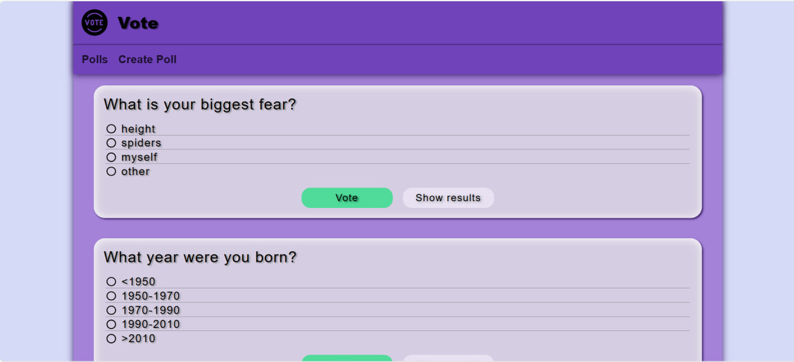
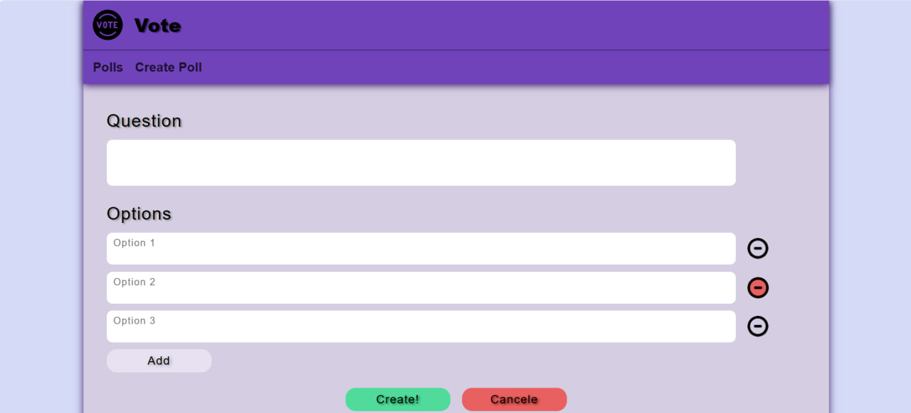
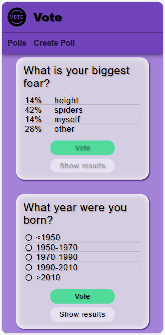

# react-poll-website

React-based SPA designed to allow you to take part in polls posted by users.

## Functionality (MVP):
- Create and publish your own polls with a one-option choice
- Take part in any poll published
- See poll results

## How it looks like:

## Todo:
- Users support
- ✅ Confirmation on create/cancel poll creation
- ✅ Confirmation cancel poll creation on menu button click if fields aren't empty?
- Poll tags and tag-based filters
- ✅ Multiple pages for viewing all polls
- Errors while creating a poll
- Fix: add 404 not found page
- Mock poll list while loading
- Implement nice display of votes
- Make poll options on hpme page tab-visible
- Remove buttons under poll after voting with !animation

Server side implements elsewhere (no).