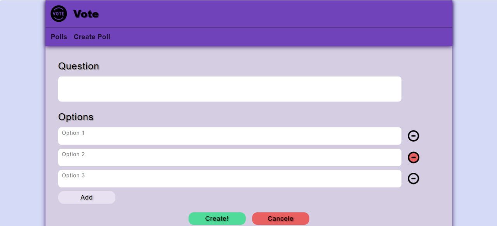

# react-poll-website

React-based SPA designed to allow you to take part in polls posted by users.

## Functionality (MVP):
- Create and publish your own polls with a one-option choice
- Take part in any poll published
- See poll results

## How it looks like:

## Todo:
- Users support
- Confirmation on cancel poll creation
- Poll tags and tag-based filters
- Multiple pages for viewing all polls

Server side implements elsewhere (no).